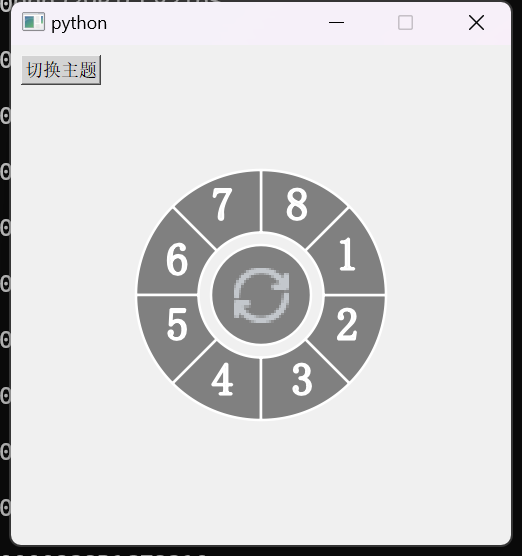
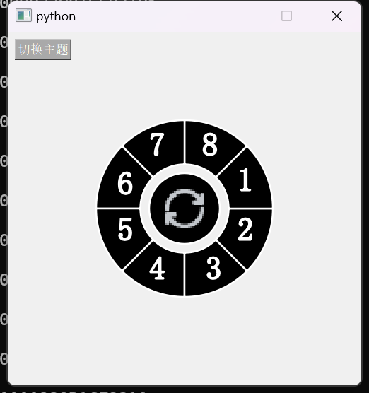

# PieMenu

PieMenu 是一个基于 PyQt5 实现的环形菜单控件。用户可以通过该控件实现不同区域的点击操作，同时可以切换明亮和暗黑主题。

## 功能特性

- 环形菜单布局
- 各扇形区域的点击检测
- 中间按钮添加图标
- 明亮和暗黑主题切换

## 截图





## 安装

1. 克隆此仓库：

   ```bash
   git clone https://github.com/yourusername/PieMenu.git
   cd PieMenu
   ```

2. 安装所需的依赖：
   ```bash
    pip install PyQt5
   ```

## 使用
运行以下命令启动 PieMenu 应用：
    ```bash
        python main.py
    ```


